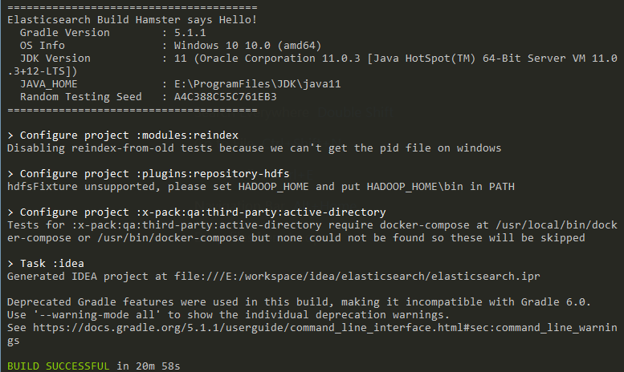
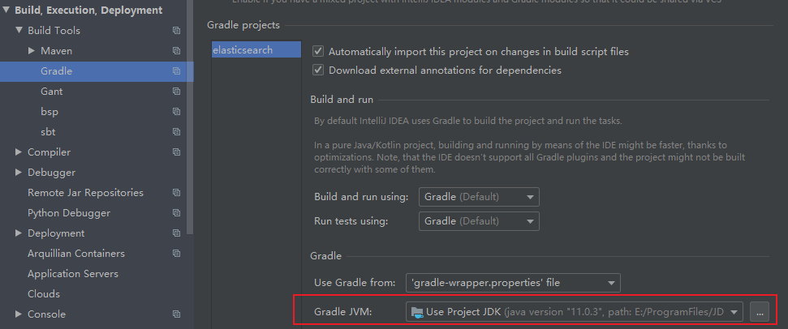

# Elasticsearch 6.6.0 源码阅读分析


# 1.构建

elasticsearch 6.6 版本运行时使用 JDK8，编译时使用 JDK11，并且使用 gradle 构建的，因此需要提前下载好环境。打开源码目录根据 OS 执行不同命令：

- Mac / Linux

  ```shell
  ./gradlew idea
  ```

- Windows

  ```shell
  gradlew idea
  ```

需要几分钟的耗时，等待编译成功：



用 IDEA 导入刚刚编译后的 elasticsearch 源码目录，注意 IDEA 的 gradle 编译版本要更新到 JDK11，不同版本的 IDEA 配置方式可能不一致，这里仅供参考



最后等待构建成功即可

# 2.运行

构建好 elasticsearch，使用idea打开，它会自动执行 gradle build，等其所有任务构建完。elasticsearch启动类为：`org.elasticsearch.bootstrap.Elasticsearch`。除此之外，还需要额外执行下面几个步骤才能成功启动：

1. 源码文件夹新建一个目录，随便取名，这里叫做`home`，然后找到 elasticsearch 启动类，手动加上几行代码，指定它的运行目录

   ```java
   // 指向启动根目录
   String home = System.getProperty("user.dir").concat(File.separator).concat("home");
   // 设置es启动环境必备参数：es.path.conf
   System.setProperty("es.path.home", home);
   System.setProperty("es.path.conf", home.concat(File.separator).concat("config"));
   System.setProperty("log4j2.disable.jmx", "true");
   System.setProperty("java.security.policy", System.getProperty("es.path.conf")
                      .concat(File.separator).concat("java.policy"));

2. 下载 6.6.0 同版本发行包（[官网下载链接](https://www.elastic.co/cn/downloads/past-releases/elasticsearch-6-6-0)），将目录中的 `/config`和`/modules`里面的文件全部拷贝到上一步创建好的`home`目录。同时需要创建一个新文件，固定名称为：`java.policy`，加上如下的内容

   ```tex
     grant {
         permission java.lang.RuntimePermission "createClassLoader";
     };
   ```

3. 通过前两步的配置以后就可以启动 elasticsearch，如果启动过程中报错，并且报错信息为：

   ```java
   java.lang.NoClassDefFoundError: org/elasticsearch/plugins/ExtendedPluginsClassLoader
   	at org.elasticsearch.plugins.PluginsService.loadBundle(PluginsService.java:494) ~[main/:?]
   	at org.elasticsearch.plugins.PluginsService.loadBundles(PluginsService.java:422) ~[main/:?]
   	at org.elasticsearch.plugins.PluginsService.<init>(PluginsService.java:146) ~[main/:?]
   	at org.elasticsearch.node.Node.<init>(Node.java:303) ~[main/:?]
   	at org.elasticsearch.node.Node.<init>(Node.java:246) ~[main/:?]
   	at org.elasticsearch.bootstrap.Bootstrap$5.<init>(Bootstrap.java:213) ~[main/:?]
   	at org.elasticsearch.bootstrap.Bootstrap.setup(Bootstrap.java:213) ~[main/:?]
   	at org.elasticsearch.bootstrap.Bootstrap.init(Bootstrap.java:323) ~[main/:?]
   	at org.elasticsearch.bootstrap.Elasticsearch.init(Elasticsearch.java:121) ~[main/:?]
   	at org.elasticsearch.bootstrap.Elasticsearch.execute(Elasticsearch.java:112) ~[main/:?]
   	at org.elasticsearch.cli.EnvironmentAwareCommand.execute(EnvironmentAwareCommand.java:86) ~[main/:?]
   	at org.elasticsearch.cli.Command.mainWithoutErrorHandling(Command.java:124) ~[main/:?]
   	at org.elasticsearch.cli.Command.main(Command.java:90) ~[main/:?]
   	at org.elasticsearch.bootstrap.Elasticsearch.main(Elasticsearch.java:92) ~[main/:?]
   	at org.elasticsearch.bootstrap.Elasticsearch.main(Elasticsearch.java:85) ~[main/:?]
   Caused by: java.lang.ClassNotFoundException: org.elasticsearch.plugins.ExtendedPluginsClassLoader
   	at jdk.internal.loader.BuiltinClassLoader.loadClass(BuiltinClassLoader.java:582) ~[?:?]
   	at jdk.internal.loader.ClassLoaders$AppClassLoader.loadClass(ClassLoaders.java:190) ~[?:?]
   	at java.lang.ClassLoader.loadClass(ClassLoader.java:499) ~[?:?]
   	... 15 more
   ```

   那么就找到 `/server`目录下build.gradle 文件，将

   ```groovy
   compileOnly project(':libs:plugin-classloader')
   ```

   改为：

   ```groovy
   compile project(':libs:plugin-classloader')
   ```
# 3 结构

- >buildSrc：构建项目相关
- >client：客户端，包括了rest-high-level-client等
- >distribution：es打包发行相关，将elasticsearch打成各种发行包（zip，deb，rpm，tar）的模块
- >docs：文档相关
- >gradle：项目管理工具
- >libs：依赖外部的类
- >licenses：一些协议说明
- >modules：es的重要模块
- >plugins：插件相关
- >qa：问题汇总
- >server：核心代码
- >test：测试类
- >x-pack：提供安全性，警报，监视，报告，机器学习和许多其他功能
